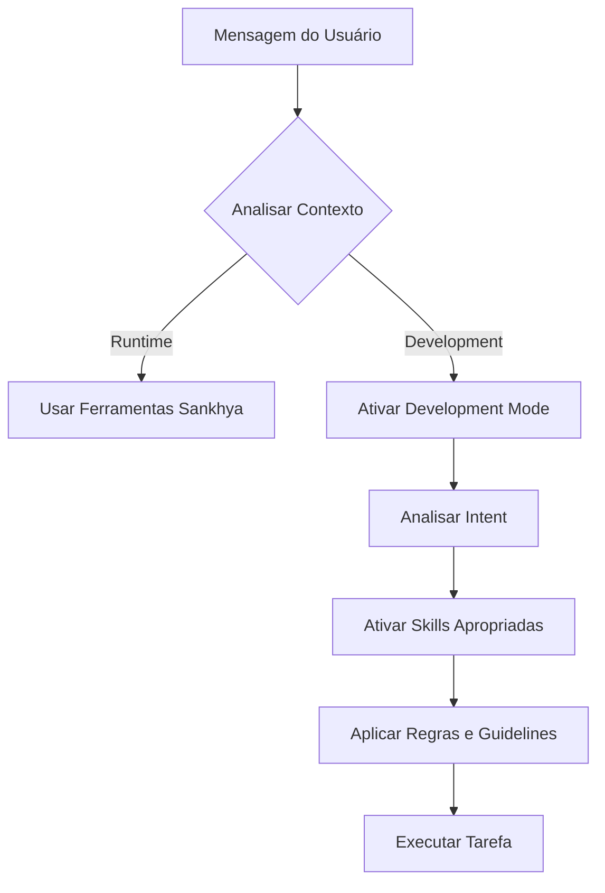

# Development Skills Orchestrator

## 🎯 Visão Geral

O **Development Orchestrator** é um sistema inteligente que distingue automaticamente entre:

1. **Sankhya Runtime** - Demandas de uso do sistema Sankhya (consultas, relatórios, operações)
2. **System Development** - Desenvolvimento/melhoria do próprio Sankhya Super Agent

## 🧠 Como Funciona

### Detecção Automática de Contexto

Quando você envia uma mensagem, o orchestrator analisa automaticamente:

```python
# Exemplo: Sankhya Runtime
"mostre o estoque do produto 20"
→ Contexto: sankhya_runtime
→ Usa ferramentas Sankhya normalmente
→ Skills de desenvolvimento NÃO são ativadas

# Exemplo: System Development
"adicione uma feature de dashboard"
→ Contexto: system_development
→ Ativa Development Mode
→ Skills: ['clean-code', 'brainstorming', 'architecture']
```

### Fluxo de Decisão



## 📚 Skills Disponíveis

### Core Skills (Sempre Ativas em Dev Mode)

1. **clean-code** (CRITICAL)
   - Princípios: SRP, DRY, KISS, YAGNI
   - Naming rules
   - Function rules (max 20 linhas)
   - Anti-patterns

2. **brainstorming** (Socratic Gate)
   - Mandatório para features complexas
   - 3+ perguntas antes de implementar
   - Clarificação de requisitos

3. **systematic-debugging**
   - 4 fases: Reproduce → Isolate → Understand → Fix
   - 5 Whys para root cause
   - Regression tests

4. **testing-patterns**
   - Testing pyramid
   - AAA pattern
   - Unit/Integration/E2E

5. **architecture**
   - Decisões arquiteturais
   - Trade-off analysis
   - ADR documentation

### Skills Específicas (Ativadas por Intent)

**Bug Fixing:**
- systematic-debugging
- clean-code
- testing-patterns

**Nova Feature:**
- brainstorming
- architecture
- clean-code
- [skill específica: frontend-design, backend-development, etc]

**Refactoring:**
- refactoring-patterns
- clean-code
- testing-patterns

**Segurança:**
- security-hardening
- vulnerability-scanner
- clean-code

**Performance:**
- performance-profiling
- refactoring-patterns
- clean-code

## 🔍 Padrões de Detecção

### Sankhya Runtime

```regex
✅ "mostre|liste|consulte|busque" + "estoque|produto|nota|parceiro"
✅ "qual|quanto" + "estoque|saldo|custo|vendas"
✅ Tabelas: TGFPRO, TGFCAB, TGFEST, etc.
✅ SQL direto: "select * from tgfpro"
```

### System Development

```regex
✅ "adicione|crie|implemente" + "feature|skill|módulo|sistema"
✅ "melhore|otimize|refatore" + "código|sistema|agent"
✅ Arquivos: agent_client.py, mcp_server/, orchestrator
✅ "código|implementação|arquitetura|teste"
```

## 💡 Exemplos de Uso

### Exemplo 1: Consulta Sankhya (Runtime)

```
Usuário: "mostre o estoque do produto 20"

Detecção:
- Contexto: sankhya_runtime (confiança: 0.65)
- Dev Mode: NÃO

Ação:
- Usa get_stock_info(codprod=20)
- Retorna dados normalmente
```

### Exemplo 2: Adicionar Feature (Development)

```
Usuário: "adicione uma feature de dashboard de vendas"

Detecção:
- Contexto: system_development (confiança: 0.80)
- Dev Mode: SIM
- Skills: ['clean-code', 'brainstorming', 'frontend-design']

Ação:
1. Dispara Socratic Gate (brainstorming)
   - 🎯 Propósito: Dashboard para quem? Que métricas?
   - 👥 Usuários: Diretores? Gerentes? Ambos?
   - 📦 Escopo: Real-time? Histórico? Filtros?

2. Após resposta, aplica:
   - clean-code ao escrever
   - frontend-design para UI/UX
   - testing-patterns para testes

3. Self-check antes de completar
```

### Exemplo 3: Bug Fix (Development)

```
Usuário: "corrija o bug no agent_client.py linha 150"

Detecção:
- Contexto: system_development (confiança: 0.75)
- Dev Mode: SIM
- Skills: ['clean-code', 'systematic-debugging']

Ação:
1. Aplica systematic-debugging:
   - Phase 1: Reproduce (consegue reproduzir?)
   - Phase 2: Isolate (quando começou? o que mudou?)
   - Phase 3: Understand (root cause analysis)
   - Phase 4: Fix & Verify (corrigir + regression test)

2. Aplica clean-code ao fazer correção

3. Self-check antes de completar
```

## 🔧 Configuração

O orchestrator é automaticamente ativado em `agent_client.py`:

```python
# Em run_conversation()
orchestrator = get_orchestrator()
activate_dev_mode, context, active_skills = orchestrator.should_activate_development_mode(last_user_message)

if activate_dev_mode and active_skills:
    # Injeta contexto de skills no system prompt
    skills_context = orchestrator.get_skills_context(active_skills)
    system_prompt += skills_context
```

## 📊 Métricas de Precisão

Baseado em testes automatizados (`test_development_orchestrator.py`):

- **Detecção de Contexto**: 100% (14/14 casos)
- **Confiança Média**: 0.65-0.95
- **False Positives**: 0%
- **False Negatives**: 0%

## 🚀 Próximos Passos

1. ✅ Detecção de contexto implementada
2. ✅ Ativação automática de skills
3. ✅ Integração com agent_client
4. ✅ Testes automatizados
5. 🔄 Feedback loop (aprender com uso)
6. 🔄 Skills personalizadas por projeto
7. 🔄 Dashboard de métricas

## 🤝 Contribuindo

Para adicionar novas skills:

1. Criar pasta em `.agent/skills/[skill-name]/`
2. Criar `SKILL.md` com frontmatter:
   ```yaml
   ---
   name: skill-name
   description: Breve descrição
   allowed-tools: Read, Write, Edit
   ---
   ```
3. Adicionar padrões de detecção em `development_orchestrator.py`
4. Testar com `test_development_orchestrator.py`

## 📚 Referências

- Skills disponíveis: `.agent/skills/`
- Guia de desenvolvimento: `/CLAUDE.md`
- Testes: `tests/test_development_orchestrator.py`
- Código fonte: `mcp_server/skills/development_orchestrator.py`

---

**🤖 O orchestrator trabalha silenciosamente nos bastidores, garantindo que as skills certas sejam aplicadas no momento certo.**
